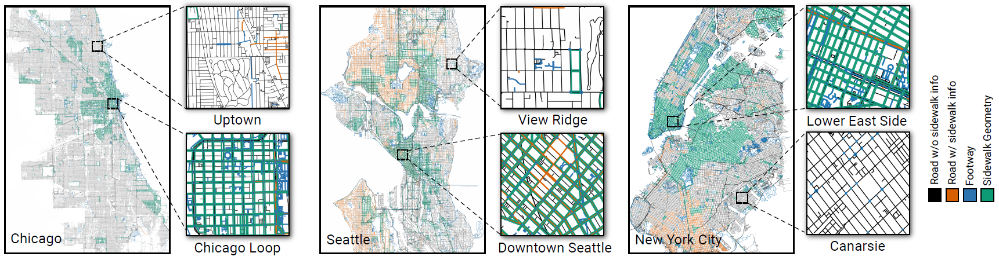
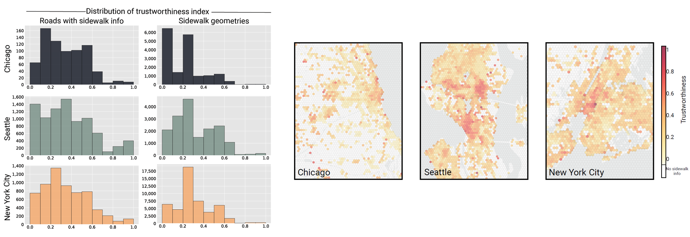

# Crowdsourcing and Sidewalk Data: A Preliminary Study on the Trustworthiness of OpenStreetMap Data in the US

This project investigates coverage of OpenStreetMap (OSM) sidewalk data and computes the trustworthiness index as an alternative measure to assess the quality of the data. There is a massive scarcity of information on the location, condition, and accessibility of sidewalks across the world, which limits interactive mapping and urban analytics. Our study takes a step toward understanding OSM sidewalk data quality by evaluating its coverage and reliability.

### Coverage of Sidewalk Data

### Trustworthiness Distribution of Sidewalk Data

This repository contains the code for the paper "Crowdsourcing and Sidewalk Data: A Preliminary Study on the Trustworthiness of OpenStreetMap Data in the US".

Authors:

Kazi Shahrukh Omar (UIC)

Gustavo Moreira (UFF)

Daniel Hodczak (UIC)

Maryam Hosseini (Rutgers / NYU)

[Fabio Miranda](https://fmiranda.me) (UIC)

**Paper: https://arxiv.org/abs/2210.02350**

The code is written in Python.